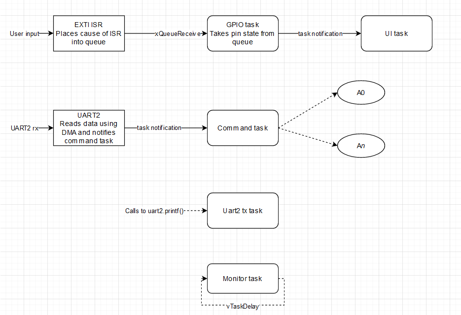

# STM32 Alarm clock

Alarm clock using Nucleo board with STM32F303K8. The RTC is DS3231. For display, I'm using an OLED display with SSD1306 driver. User input is taken from a rotary encoder.

The project is built in Platformio, using HAL libraries.

## Documentation
The project is documented using doxygen.

## Libraries
Parts of the project are implemented as libraries. This is done, so they can be tested individually.

### pin_api
Simplified pin manipulation, a lightweight wrapper around ST HAL libraries. Using this library, we can refer to pins by labels e.g. *PA0* refers to pin 0 of port GPIOA. The library translates these pin labels to port and pin number, and calls the respective HAL function.

### Ring buffer
Ring buffer used in UART library. The buffer is used for both transmission and reception using DMA. The library provides the possibility to take/reserve continuous parts of it's underlying buffer, which allows for faster continuous processing.

### uart_dma
UART helper library. The library allows for immediate transmission, using HAL_UART_Transmit, but also buffering of messages. Non-immediate messages are sent from a separate task. printf-style formatting is supported using the [nanoprintf](https://github.com/charlesnicholson/nanoprintf) library. If configured, a task will be notified when RX event is done.

### command_parser
Parses a series of characters, and calls the corresponding function. Multiple command parsers can co-exist for multiple sources of commands.

### DS3231
Library based on the [DS3231 datasheet](https://datasheets.maximintegrated.com/en/ds/DS3231.pdf). Supports reading/setting the time and reading/setting both alarms. Uses a reference to *RTOS_I2C* class for communication.

### simple_i2c
Thread safe(RTOS_I2C) and simple(Simple_I2C) wrappers around HAL library. The RTOS_I2C library locks the resource using a mutex. A mutex lock can be also acquired for lower-level control of the I2C interface.

### utility
Contains utility functions and a RAII Rtos Lock. The Lock will take a mutex in it's constructor, and give it in it's destructor. Moving of locks is supported.

### SSD1306
SSD1306 display driver and graphics library. The graphics library(GFX) support drawing of primitives and text rendering using a custom font and nanoprintf. The memory layout is configured, so the whole internal buffer can be transmitted to the SSD1306 as a continuous stream of data.

### encoder
Event driven encoder tracker and button driver with debouncing(BtnTracker). The calls to the BtnTracker library return the timeout until the next call to be made, to track *Release*, *Hold* and *Press* events. This allows to have an event based task tracking the state of the button, without the need for polling and needless processing. This approach will allow the FreeRTOS to go to tickless idle, and conserve power, until an interrupt is generated from user input.

### FreeRTOS
The official freertos package configured as a library

## Sources
The FreeRTOS tasks are implemented in the src folder. The project uses 5 tasks:
1. **UI task** - responsible for reacting to encoder and button state changes, and rendering to the display.
1. **Command task** - handles commands coming from UART2. The UART_DMA task notifies this task on RX.
1. **GPIO task** - Reads GPIO events from a queue, and notifies UI task
1. **monitor task** - For debug. Tracks memory consumption of the other tasks. This task is periodic, but is for Debug only
1. **UART2 TX task** - task started by the UART_DMA library for UART 2

For dynamic memory, *heap_1* is used. All tasks are created only once, so no need for free().

Tickless idle is used, to conserve power used. The MCU goes to sleep, after 10 seconds of inactivity. After 10 seconds, all tasks will be in the waiting state, and will wait for events from interrupts.

## Tests
Platformio allows for easy testing of libraries, directly on the hardware. Test are done inside a FreeRTOS environment - like the main application. Individual library tests are implemented inside a FreeRTOS task, which is called from `test_main.cpp` file. UART2 is used by the testing framework, and must not be used inside the tests.

### Task layout

